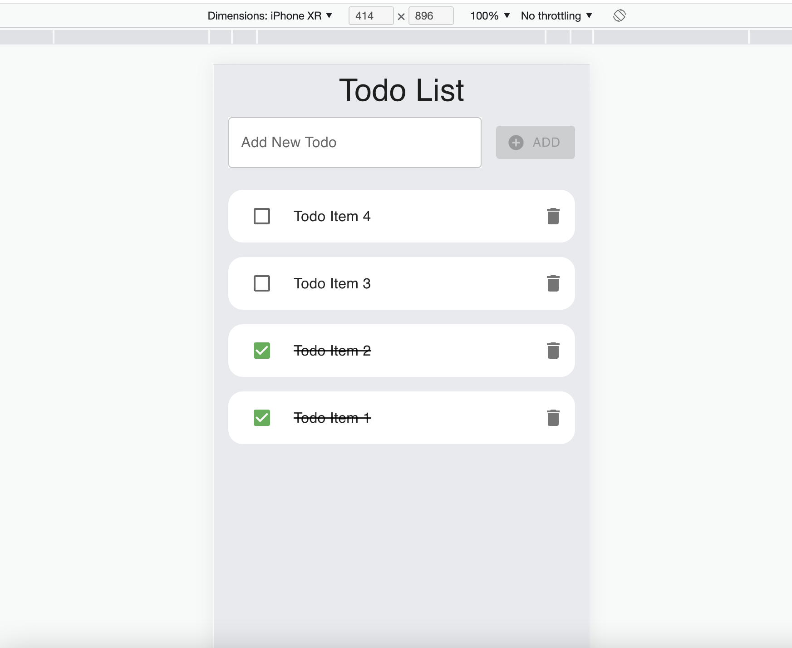
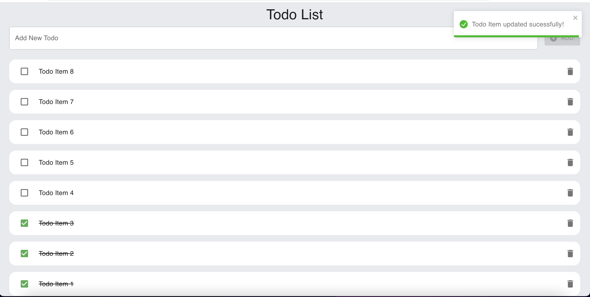

# Todo App

This is a simple Todo app built with React, TypeScript, and Context API. It allows users to create, read, update, and delete todo items.

## Screenshots

  
  

## Technology Stack

- **ReactJS**
- **TypeScript**
- **ContextAPI**
- **MUI**
- **Jest** & **React Testing Library**
- **CRA with customize-cra**

## Packages.

- Axios
- immer
- react-toastify

## Scripts

### Run Project Locally

`npm run start` It starts local api server on port:3000 and UI on port:4200.

### Generate Dist folder for production

`npm run build`

### Running Tests

`npm run test`

### Run eslint for checking the project's files

`npm run lint`

## Todo

1. Write more unit tests.
2. Dark Theme
